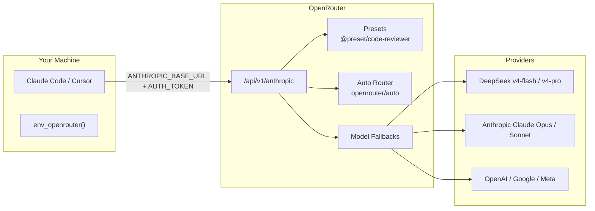
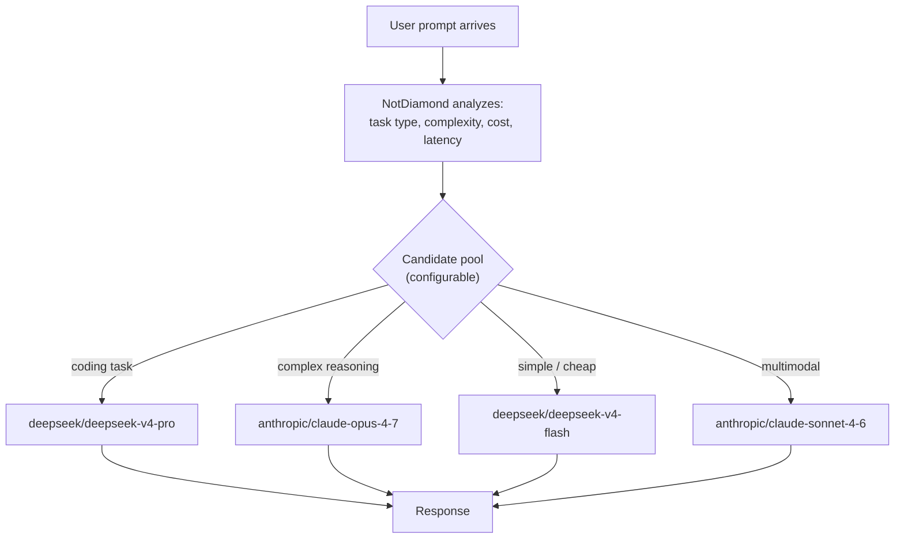
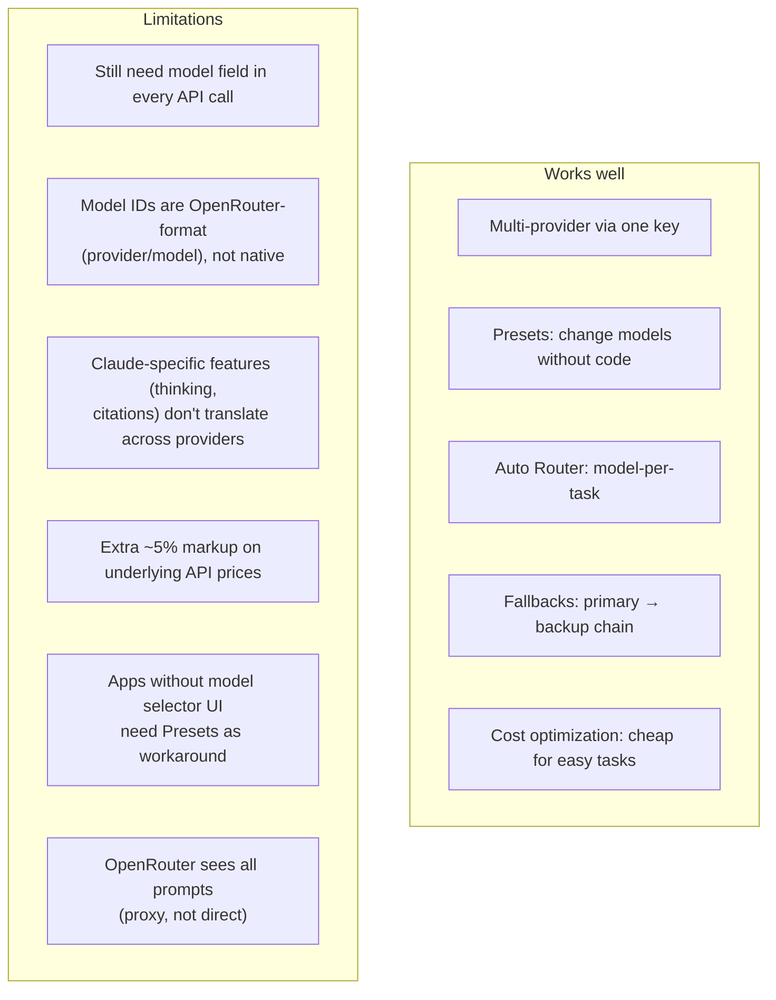
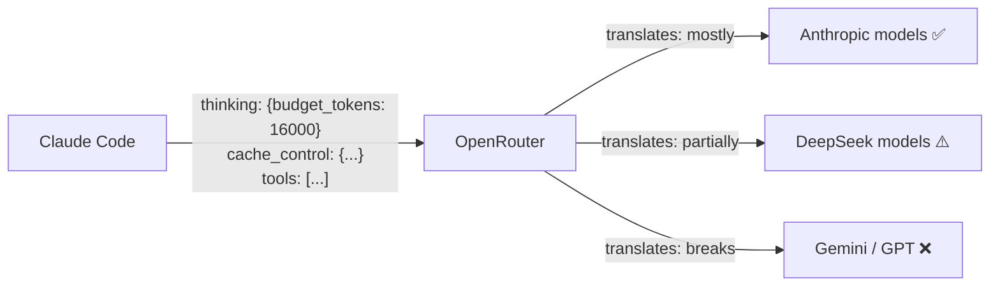

# Models

## Architecture

Two env functions configure Claude Code to use alternative LLM backends via the Anthropic-compatible API:

| Function | Backend | Key env var |
|----------|---------|-------------|
| `env_deepseek` | api.deepseek.com | `DEEPSEEK_API_KEY` |
| `env_openrouter` | openrouter.ai | `OPENROUTER_API_KEY` |

The mapping:

| Slot | DeepSeek direct | OpenRouter |
|------|----------------|------------|
| Default (`ANTHROPIC_MODEL`) | `deepseek-v4-flash` | `deepseek/deepseek-v4-flash` |
| Opus (`DEFAULT_OPUS_MODEL`) | `deepseek-v4-pro[1m]` | `deepseek/deepseek-v4-pro` |
| Sonnet (`DEFAULT_SONNET_MODEL`) | `deepseek-v4-flash` | `deepseek/deepseek-v4-flash` |
| Haiku (`DEFAULT_HAIKU_MODEL`) | `deepseek-v4-flash` | `deepseek/deepseek-v4-flash` |
| Subagent | `deepseek-v4-flash` | `deepseek/deepseek-v4-flash` |

## Model tiers (DeepSeek V4)

Only two tiers exist. No intermediate "standard" model.

|  | Flash | Pro |
|---|---|---|
| Params (total/active) | 284B / 13B | 1.6T / 49B |
| SWE-bench Verified | 79.0 | 80.6 |
| GPQA Diamond | 88.1 | 90.1 |
| Price (in/out per 1M) | $0.14 / $0.28 | $0.145 / $1.74 |

Flash is slightly below Claude Sonnet 4.6 on most benchmarks (within ~2 points). Pro is tied with Claude Opus 4.7 on SWE-bench and leads on LiveCodeBench. See `env_deepseek --help` or the [DeepSeek V4 guide](https://codersera.com/blog/deepseek-v4-complete-guide-2026/) for current numbers.

## Why put model config on the provider side

Models change fast (biweekly cadence is common). Storing exact model names in dotfiles means commits every time a provider ships a new version. OpenRouter solves this:

- **One API key** for all providers (no new `.env` entries per model)
- **Change models on their dashboard** — Settings > Plugins, or per-request `plugins` param
- **Auto Router** — `openrouter/auto` picks the best model for each prompt; restrict the pool with glob patterns (`anthropic/*`, `deepseek/*`)
- **Model Fallbacks** — chain fallback models if primary is down/slow

The `env_openrouter` function sets sensible defaults. Override per-session:

```sh
env_openrouter
export ANTHROPIC_MODEL=openrouter/auto  # let OpenRouter pick
```

Or narrow the auto-router pool via the OpenRouter dashboard (Settings > Plugins > Auto Router). No dotfile edits needed.

## OpenRouter architecture



One API key routes to hundreds of models across providers. The `ANTHROPIC_BASE_URL` and `ANTHROPIC_AUTH_TOKEN` env vars point Claude Code at OpenRouter's Anthropic-compatible endpoint.

## Auto Router: automatic model-per-task

OpenRouter has a built-in model classifier (powered by NotDiamond) that analyzes each prompt's task type, complexity, and cost — then picks the best model:



Usage: set `ANTHROPIC_MODEL=openrouter/auto`. The router picks per-prompt. No code changes needed.

## Multi-provider ensemble candidates

Yes — the Auto Router pool spans providers. Restrict it with glob patterns:

- Dashboard: Settings > Plugins > Auto Router → set `allowed_models`
- Per-request: `"plugins": [{"id": "auto-router", "allowed_models": ["anthropic/*", "deepseek/*", "google/*"]}]`

Candidates can mix Anthropic, DeepSeek, OpenAI, Google, Meta — any model on OpenRouter. The router learns which models handle which tasks best and optimizes for cost/quality.

## Presets: configure without code

Presets are named, web-managed configs that bundle model selection, routing, system prompts, and parameters. Reference them as `@preset/my-preset` in the model field.

Use case: an app that doesn't expose a model selector UI. Create a preset on openrouter.ai, reference it as the model, and change its configuration on the web without touching the app's settings.

## Limitations



## Claude Code specific concern

Claude Code sends Anthropic-native parameters (thinking budget, cache control, tool use format). When OpenRouter routes to non-Anthropic models:



**Recommendation:** restrict Auto Router's `allowed_models` to `["anthropic/*", "deepseek/*"]` for Claude Code. These two families speak the Anthropic protocol well enough. Adding Gemini or GPT to the pool would break on tool-calling or thinking-mode requests.

## OpenRouter Q&A

**Q: Does OpenRouter have a model classifier that auto-switches per task for best quality/cost?**

Yes — the Auto Router (`openrouter/auto`), powered by NotDiamond. It analyzes each prompt for task type and complexity, then picks the optimal model from your configured pool. Coding → strong coding model, simple chat → cheap model. No per-request decisions on your side.

**Q: Is this switching overridable via OpenRouter config?**

Yes, at two levels. Dashboard defaults (Settings > Plugins > Auto Router, set `allowed_models`) apply globally. Per-request `plugins` array overrides for a specific call. Beyond the router, **Presets** (`@preset/my-preset`) bundle model choice, routing, and params into named configs — switch between them without touching dashboard settings.

**Q: Can models from different companies be in the router ensemble?**

Yes. The Auto Router pool spans Anthropic, DeepSeek, OpenAI, Google, Meta by default. You restrict it with `allowed_models` glob patterns. A realistic Claude Code pool: `["anthropic/*", "deepseek/*"]` — these speak the Anthropic protocol. `["google/*", "openai/*"]` break on thinking-mode and tool-call requests.

**Q: Do I still need to specify the model per-request? What about apps with no model selector?**

Yes, the `model` field is still required. But:
- **App has a model field** → set to `openrouter/auto` once, done.
- **App has NO model field** → use a **Preset**. Create it on openrouter.ai, reference `@preset/my-preset` in whatever field the app exposes (URL, key, or model). Change the preset's internals on the web without touching the app.

The `env_openrouter` function handles all model slots for Claude Code specifically — default, opus, sonnet, haiku, and subagent.
