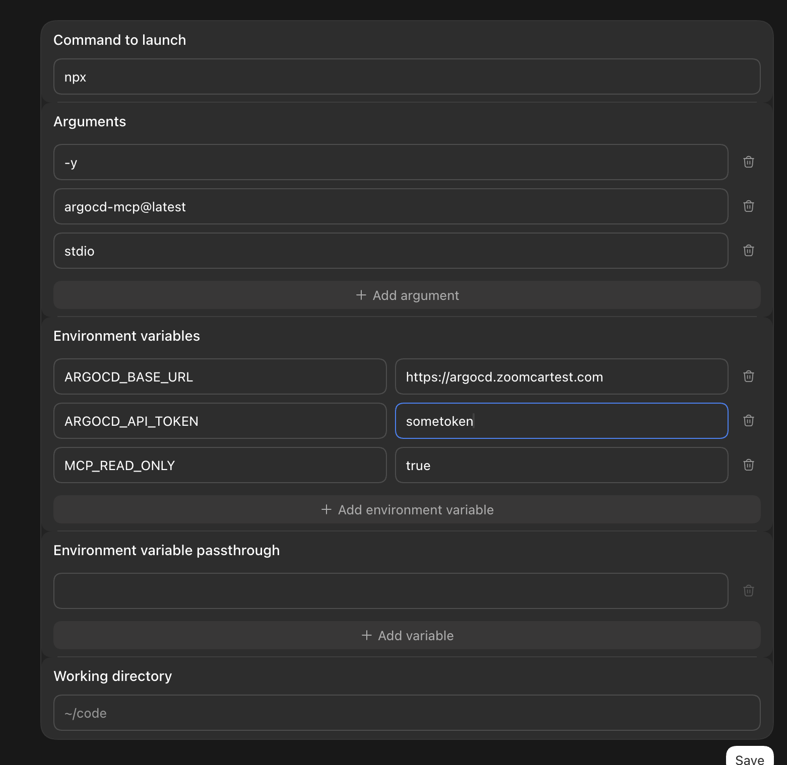
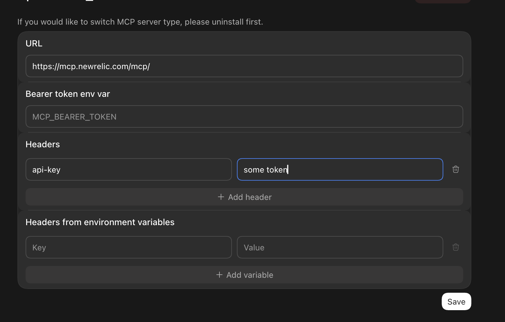
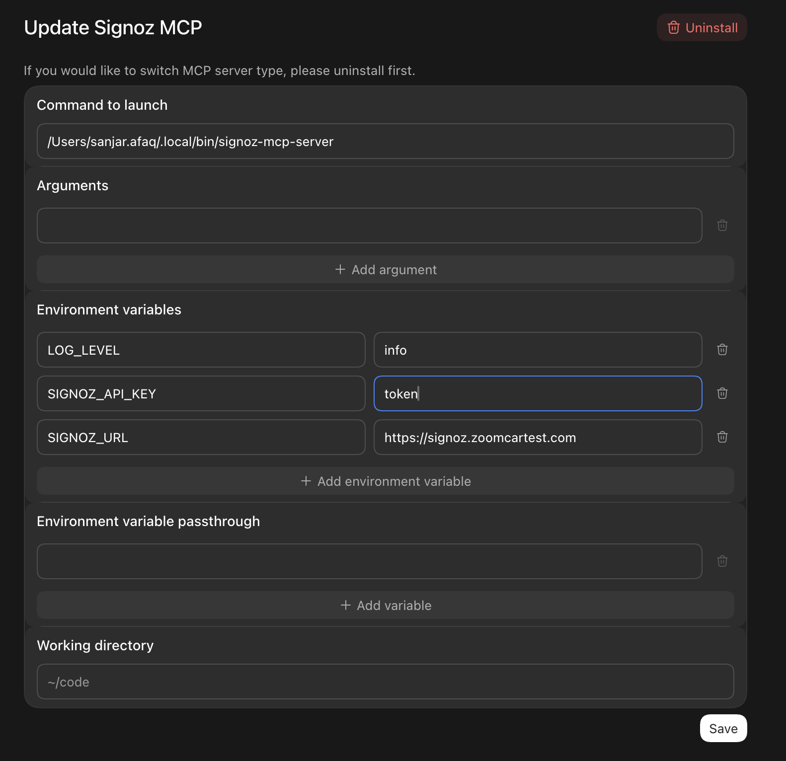

- argocd_staging
  
- atlassian
- codebase-memory-mcp
- computer-use
- figma
- iterm-mcp
- mobile-mcp
- neobrowser
- Skill: Ego Browser
- new_relic
  
- node_repl
- postman, url: https://mcp.postman.com/mcp
- signoz
    
- tablepro_mcp
  Command: `/Applications/TablePro.app/Contents/MacOS/tablepro-mcp`
- Atlassian Rovo (Legacy)
- Google Drive
- Google Calendar
- Gmail
- Slack
- Notion
- Skill: Ponytail
